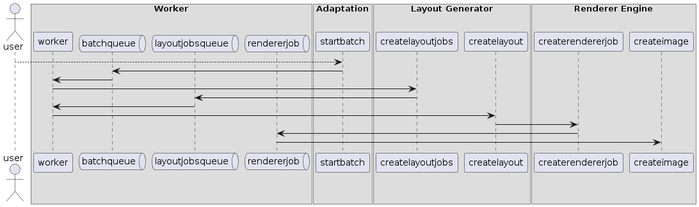

# Adaptação e Replicação de Layouts
# Status
*proposto*

# Contexto
Nova métodologia para o processo de geração dos layouts

# Decisão
O processo de geração é de longe o que precisa de mais processamento, para lidar com isso de forma eficiente e escalável
precisamos mover para filas todos as requisições para geração.

# Consequencias
